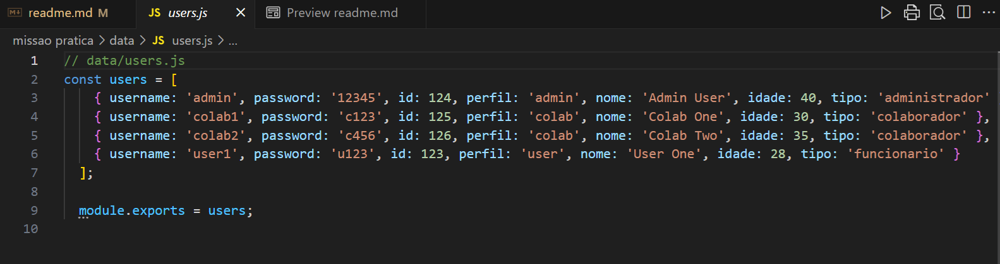
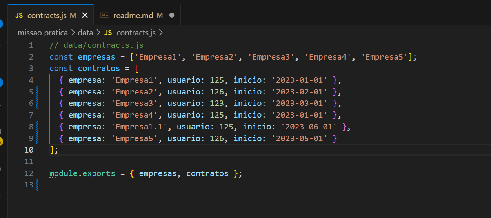

# Missão Prática - M5.N5

## Objetivos

Os objetivos são de tratar um legado refatorando codigo e restruturando de forma clara e concisa onde tudo foi descrito no documento "descritivo.pdf"

 

## Ativação do Projeto
Este projeto implementa um servidor backend utilizando Node.js com Express e um frontend em HTML para realizar autenticação e consultar dados. A aplicação foi projetada para corrigir falhas de segurança em uma aplicação legada e melhorar sua estrutura.

## Estrutura do Projeto
A aplicação está dividida em várias pastas para facilitar a manutenção:
- **data/**: Contém dados de exemplo de usuários e contratos.
- **middleware/**: Middleware para autenticação e bloqueio de login.
- **routes/**: Rotas para autenticação, usuários e contratos.
- **utils/**: Configurações gerais do sistema.
- **public/**: Arquivos estáticos, como o frontend `index.html`.
- **server.js**: Arquivo principal que inicia o servidor backend.
- **auth.js**: Arquivo frontend para comunicação com a API.

## Requisitos
Certifique-se de ter instalado:

- **Node.js** (versão 14 ou superior)
- **NPM** (gerenciador de pacotes do Node.js)

## Instalação
1. Clone este repositório:
   ```bash
   git clone <url-do-repositorio>
   ```
2. Navegue até o diretório do projeto:
   ```bash
   cd <nome-do-diretorio>
   ```
3. Instale as dependências:
   ```bash
   npm install
   ```

## Inicializando o Servidor
1. Inicie o servidor backend:
   ```bash
   node server.js
   ```
2. O servidor estará rodando em `http://localhost:3000`.

## Utilizando o Frontend
1. Acesse o arquivo `index.html` servindo-o através do servidor.
   - O arquivo está localizado na pasta `public/` e é automaticamente servido pelo servidor em `http://localhost:3000/index.html`.
2. Realize o login utilizando os seguintes dados de exemplo:
   - Usuário: `admin`
   - Senha: `12345`
3. Utilize os botões no frontend para listar perfis, contratos e visualizar o perfil do usuário logado.

## Testando as Rotas via Postman/Insomnia
 
- **Login:**
  - URL: `http://localhost:3000/api/auth/login`
  - Método: POST
  - Corpo: `{ "username": "admin", "password": "12345" }`
   
   obs: apenas o admin tem acesso a todos os endpoints
   
   
 

- **Listar Usuários:**
  - URL: `http://localhost:3000/api/users`
  - Método: GET
  - Cabeçalho: `Authorization: Bearer <token>`

   

- **Perfil do Usuário:**
  - URL: `http://localhost:3000/api/auth/profile`
  - Método: GET
  - Cabeçalho: `Authorization: Bearer <token>`


## Testando as Rotas via Insomnia

Por motivos pessoais, para a interação com a API, foi utilizado o Insomnia como ferramenta de teste. Aqui foi configurada uma variável de ambiente para o token, acessada através do atalho `CTRL + E` para criar e gerenciar ambientes no Insomnia.

### Configuração do Ambiente
1. No Insomnia, acesse **Manage Environments** ou pressione `CTRL + E`.
2. Crie um ambiente global ou de coleção com a seguinte estrutura:
   ```json
   {
     "token": ""
   }
   ```

   

3. Após realizar o login e obter o token, copie o valor retornado e atribua-o à variável `token`.
4. Utilize `{{token}}` no cabeçalho `Authorization` nas requisições:
   ```
   Authorization: Bearer {{token}}
   ```

    


### Mocks

- **Usuários**
<p>


-**Empresas**
<p>


### Endpoints usando insominia

- **Login:**
  - URL: `http://localhost:3000/api/auth/login`
  - Método: POST
  - Corpo: `{ "username": "admin", "password": "12345" }`

 
- **Listar Usuários:**
  - URL: `http://localhost:3000/api/users`
  - Método: GET
  - Cabeçalho: `Authorization: Bearer {{token}}`

 

- **Filtrar Empresas por nome :**
  - URL: `http://localhost:3000/api/contracts` + (?empresa=Empresa1 ou ?empresa=Empre*)
  - Método: GET
  - Cabeçalho: `Authorization: Bearer {{token}}`
  - parametro: Empresa1 ou Empre*

   - **Exato** <p>
 


   - **Aproximado** <p>
 

- **Filtrar Empresas por nome e data :**
  - URL: `http://localhost:3000/api/contracts` + (?empresa=Empresa1 ou ?empresa=Empre*)
  - Método: GET
  - Cabeçalho: `Authorization: Bearer {{token}}`
  - parametro1: Empresa1 ou Empre*
  - parametro2: Data YYYY-MM-dd
  <p>
  
 
- **Listar Empresas:**
  - URL: `http://localhost:3000/api/contracts/all`
  - Método: GET
  - Cabeçalho: `Authorization: Bearer {{token}}`

 


- **Perfil do Usuário:**
  - URL: `http://localhost:3000/api/auth/profile`
  - Método: GET
  - Cabeçalho: `Authorization: Bearer {{token}}`

  

## Observações
1. A pasta `public/` agora contém o frontend e é referenciada no servidor através do método `express.static`, permitindo servir arquivos estáticos como `index.html`.

- URL: `http://localhost:3000/index.html`


2. A duração do token pode ser ajustada no arquivo `utils/config.js`. Após alterações, reinicie o servidor para aplicar as mudanças.


3. Permissionamentos 

Aqui está a tabela que representa o permissionamento para os perfis de usuários com base nas ações/endpoints:

| **Usuário**      | **Senha** | **Lista Usuários** | **Filtro por Empresa** | **Listar Empresas** | **Perfil do Usuário** |
|-------------------|-----------|--------------------|-------------------------|---------------------|------------------------|
| **admin**         | 12345     | ✔️                 | ✔️                      | ✔️                  | ✔️                     |
| **user1**         | u123      | ✔️                 | ❌                      | ❌                  | ✔️                     |
| **colab1**        | c123      | ❌                 | ❌                      | ❌                  | ✔️                     |
| **colab2**        | c456      | ❌                 | ❌                      | ❌                  | ✔️                     |

### Legenda
- ✔️: Permissão concedida
- ❌: Permissão negada

### Observação
Essa tabela pode ser adicionada no README para esclarecer quais ações cada perfil de usuário pode realizar no sistema, ajudando na compreensão do permissionamento configurado.

## Estrutura do Repositório
A organização do repositório visa separar responsabilidades para facilitar manutenção e expansão futura:
- **data/**: Dados simulados para usuários e contratos.
- **middleware/**: Middleware de autenticação e controle de acesso.
- **routes/**: Definições de rotas para cada funcionalidade.
- **utils/**: Configurações e funções auxiliares.
- **public/**: Arquivos estáticos para o frontend.

Consulte a estrutura detalhada no repositório para visualizar como os arquivos estão organizados.

